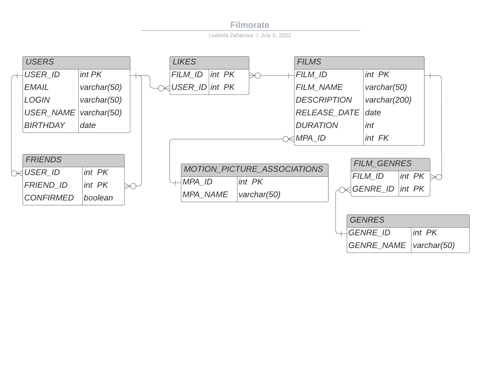

# java-filmorate
## Приложение для подбора фильмов для просмотра.
## ER - диаграмма

#### Запрос на получение всех пользователей:

SELECT *  
FROM users

#### Запрос на получение пользователя по id:

SELECT *  
FROM users AS us  
WHERE us.id = ?искомый_ID

#### Запрос на получение общих друзей:

SELECT u.user_id,  
       u.email,  
       u.login,  
       u.name,  
       u.birthday,  
FROM friends AS fr1  
INNER JOIN friends AS fr2 ON fr1.friend_id = fr2.friend_id  
LEFT OUTER JOIN users u on fr1.friend_id = u.user_id
WHERE fr1.user_id = ?искомый_ID1 AND fr2.user_id = ?искомый_ID2   
        AND fr1.confirmed IS TRUE AND fr2.confirmed IS TRUE

#### Запрос на получение всех фильмов:

SELECT *  
FROM films

#### Запрос на получение фильма по id:

SELECT *   
FROM films AS fl  
WHERE fl.id = ?искомый_ID

#### Запрос на получение популярных фильмов:

SELECT 
    f*  
FROM FILMS AS f  
LEFT OUTER JOIN LIKES AS l ON f.id = l.film_id  
GROUP BY f.id  
ORDER BY COUNT(l.user_id) DESC   
LIMIT ?количество, выводимое на экран

