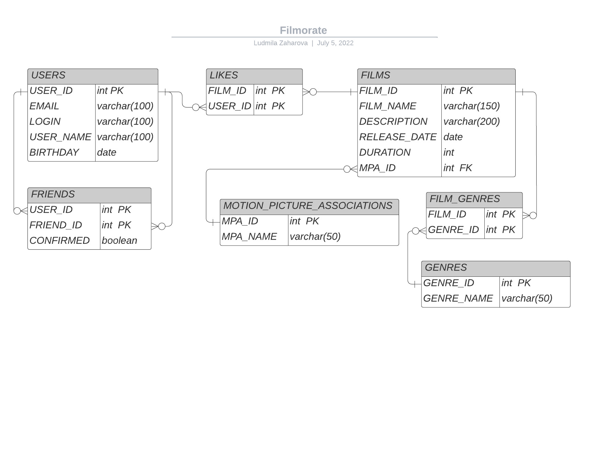

# java-filmorate
## Приложение для подбора фильмов для просмотра.
Фильмов много — и с каждым годом становится всё больше. Чем их больше, тем больше разных оценок. 

Чем больше оценок, тем сложнее сделать выбор. Это бэкенд для сервиса, который будет работать с фильмами и оценками пользователей,
а также возвращать топ-5 фильмов, рекомендованных к просмотру.

Доступна следующая функциональность:

Работа с пользователями:
- Добавление пользователя;
- Обновление пользователя;
- Получение списка всех пользователей;
- Получение пользователя по его Id;
- Добавление пользователя в друзья;
- Удаление пользователя из друзей;
- Получение списка друзей пользователя;
- Получение списка общих друзей пользователей;

Работа с фильмами:
- Добавить фильм;
- Обновить фильм;
- Удалить фильм;
- Получить список всех фильмов;
- Получить фильм по его Id;
- Поиск фильмов по наименованию и режиссеру;
- Поставить лайк фильму;
- Получить N лучших фильмов, отсортированных по убыванию рейтинга;
- Получить список всех жанров фильмов;
- Получить список всех возрастных рейтингов фильмов;
- Сформировать список самых популярных фильмов по жанрам и годам;
- Добавление отзывов к фильмам;
- Получение рекомендации фильмов для просмотра;
- Добавить режжисера фильма;

#### Стек технологий: REST API, Spring Boot, Java DataBase Connectivity, Apache Maven, PostgreSQL, JUnit.
#### Минимальные требования для запуска:
- Среда разработки, например, IntelliJ IDEA 2022.1.3
- Java Development Kit (JDK) 11.0.14
- PostgreSQL 14

## ER - диаграмма

#### Запрос на получение всех пользователей:

SELECT *  
FROM users

#### Запрос на получение пользователя по id:

SELECT *  
FROM users AS us  
WHERE us.id = ?искомый_ID

#### Запрос на получение общих друзей:

SELECT u.user_id,  
       u.email,  
       u.login,  
       u.name,  
       u.birthday,  
FROM friends AS fr1  
INNER JOIN friends AS fr2 ON fr1.friend_id = fr2.friend_id  
LEFT OUTER JOIN users u on fr1.friend_id = u.user_id
WHERE fr1.user_id = ?искомый_ID1 AND fr2.user_id = ?искомый_ID2   
        AND fr1.confirmed IS TRUE AND fr2.confirmed IS TRUE

#### Запрос на получение всех фильмов:

SELECT *  
FROM films

#### Запрос на получение фильма по id:

SELECT *   
FROM films AS fl  
WHERE fl.id = ?искомый_ID

#### Запрос на получение популярных фильмов:

SELECT 
    f*  

FROM FILMS AS f  
LEFT OUTER JOIN LIKES AS l ON f.id = l.film_id  
GROUP BY f.id  
ORDER BY COUNT(l.user_id) DESC   
LIMIT ?количество, выводимое на экран
